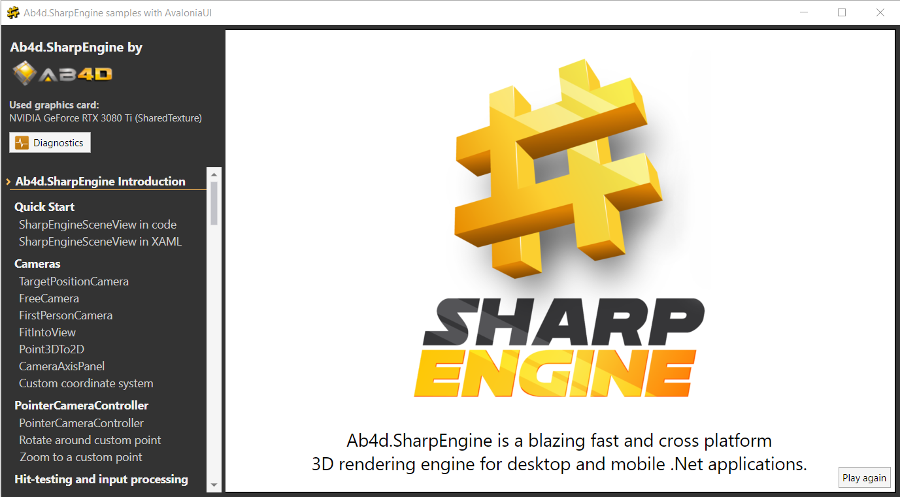

# Ab4d.SharpEngine.Samples



Welcome to the Samples for Ab4d.SharpEngine.

**Ab4d.SharpEngine is a cross-platform Vulkan based 3D rendering engine for desktop and mobile .Net applications.**

Vulkan is a high performance graphics and cross-platform API that is similar to DirectX 12 but can run on multiple platforms.

The following features are supported by the current version:
- Using any coordinate system (y-up or z-up, right-handed or left-handed)
- Many SceneNode objects (boxes, spheres, planes, cones, lines, poly-lines, curves, etc.)
- Object instancing (InstancedMeshNode)
- Cameras: TargetPositionCamera, FirstPersonCamera, FreeCamera, MatrixCamera
- Camera controllers with rotate around mouse position, zoom to position and other advanced functions
- Lights: AmbientLight, DirectionalLight, PointLight, SpotLight, CameraLight
- Effects: StandardEffect, SolidColorEffect, VertexColorEffect, ThickLineEffect
- ReaderObj to read 3D models from obj files
- Import 3D objects from glTF files and export the scene to glTF file by using [Ab4d.SharpEngine.glTF](https://www.nuget.org/packages/Ab4d.SharpEngine.glTF)
- Assimp importer that uses a third-party library to import 3D models from almost any file format


### Platforms and UI frameworks:

**Windows:**
  - AvaloniaUI support with SharpEngineSceneView control (Ab4d.SharpEngine.AvaloniaUI library)
  - WPF full composition support with SharpEngineSceneView control (Ab4d.SharpEngine.Wpf library)
  - WinUI 3 support with SharpEngineSceneView control (Ab4d.SharpEngine.WinUI library)
  - WinForms support with SharpEngineSceneView control (Ab4d.SharpEngine.WinForms library)
  - Uno Platform
  - MAUI
  - Using SDL or Glfw (using a third-party Silk.Net library; the same project also works on Linux)
  - ImGui (using a third-party ImGui.NET library)
  
**Linux** (including Raspberry PI 4 and similar devices):
  - AvaloniaUI support with SharpEngineSceneView control (Ab4d.SharpEngine.AvaloniaUI library)
  - Uno Platform
  - Using SDL or Glfw (using third-party Silk.Net library; the same project also works on Windows)
  - Off-screen rendering combined with Linux framebuffer display (FbDev or DRM/KMS).
  - ImGui (using a third-party ImGui.NET library)
  - See ["Vulkan on Raspberry Pi 4"](https://www.ab4d.com/SharpEngine/Vulkan-rendering-engine-on-Raspberry-Pi-4.aspx) guide on how to use SharpEngine on Raspberry Pi 4 with an external monitor.
  
**Android:**
  - Using AvaloniaUI with SharpEngineSceneView control (Ab4d.SharpEngine.AvaloniaUI library).
  - Using SurfaceView in C# Android Application
  - Using SDL (using third-party Silk.Net library)
  - MAUI
  
**macOS:**
  - Using AvaloniaUI with SharpEngineSceneView control (Ab4d.SharpEngine.AvaloniaUI library). Requires MoltenVK library - see special project for macos.
  - Using MAUI - requires MoltenVK library - see Building for macOS and iOS below.
   
**iOS:**
  - AvaloniaUI with SharpEngineSceneView control (Ab4d.SharpEngine.AvaloniaUI library). Requires MoltenVK library - see Building for macOS and iOS below.
  - Using MAUI - requires .Net 8 and MoltenVK library - see "Building for macOS and iOS" below.


Online help:
[Online Ab4d.SharpEngine Reference help](https://www.ab4d.com/help/SharpEngine/html/R_Project_Ab4d_SharpEngine.htm)


### Dependencies:
- The core Ab4d.SharpEngine library has NO EXTERNAL dependencies.
- The Ab4d.SharpEngine.Wpf has NO EXTERNAL dependencies.
- The Ab4d.SharpEngine.WinUI has NO EXTERNAL dependencies.
- The Ab4d.SharpEngine.WinForms has NO EXTERNAL dependencies.
- The Ab4d.SharpEngine.AvaloniaUI library requires Avalonia library.
- The Ab4d.SharpEngine.glTF.


### System requirements to run the samples:
- NET 6.0+
- NET 8.0 is required to use MAUI


### System requirements to open the sample projects:
- Visual Studio 2022 on Windows (VS 2019 does not support .Net 6)
- Rider from JetBrains on Windows, Linux and macOS
- Visual Studio Code on Windows, Linux and macOS


### Notice:
Ab4d.SharpEngine.glTF library use source code from glTF2Loader with PR from ZingBallyhoo (https://github.com/KhronosGroup/glTF-CSharp-Loader/pull/51).
glTF2Loader library is publushed under the following MIT license:

This license is for the C# reference loader, not the rest of the repository.

Copyright (c) 2015, Matthew and Xueru McMullan All rights reserved.

Redistribution and use in source and binary forms, with or without modification, are permitted provided that the following conditions are met:

Redistributions of source code must retain the above copyright notice, this list of conditions and the following disclaimer.

Redistributions in binary form must reproduce the above copyright notice, this list of conditions and the following disclaimer in the documentation and/or other materials provided with the distribution.

THIS SOFTWARE IS PROVIDED BY THE COPYRIGHT HOLDERS AND CONTRIBUTORS "AS IS" AND ANY EXPRESS OR IMPLIED WARRANTIES, INCLUDING, BUT NOT LIMITED TO, THE IMPLIED WARRANTIES OF MERCHANTABILITY AND FITNESS FOR A PARTICULAR PURPOSE ARE DISCLAIMED. IN NO EVENT SHALL THE COPYRIGHT HOLDER OR CONTRIBUTORS BE LIABLE FOR ANY DIRECT, INDIRECT, INCIDENTAL, SPECIAL, EXEMPLARY, OR CONSEQUENTIAL DAMAGES (INCLUDING, BUT NOT LIMITED TO, PROCUREMENT OF SUBSTITUTE GOODS OR SERVICES; LOSS OF USE, DATA, OR PROFITS; OR BUSINESS INTERRUPTION) HOWEVER CAUSED AND ON ANY THEORY OF LIABILITY, WHETHER IN CONTRACT, STRICT LIABILITY, OR TORT (INCLUDING NEGLIGENCE OR OTHERWISE) ARISING IN ANY WAY OUT OF THE USE OF THIS SOFTWARE, EVEN IF ADVISED OF THE POSSIBILITY OF SUCH DAMAGE.


## Sample solutions

The following Visual Studio solutions are available:

- **Ab4d.SharpEngine.Samples.AvaloniaUI**\
  This sample uses Avalonia UI (https://avaloniaui.net/) that provides WPF-like object model to 
  build UI controls and can run on Windows, Linux and macOS.
  This sample uses Ab4d.SharpEngine.AvaloniaUI library that provides SharpEngineSceneView control.
  The SharpEngineSceneView provides an Avalonia control that is very easy to use and can 
  compose the 3D scene with the Avalonia UI objects (for example, showing buttons on top of the 3D scene).
  The sample can be started on Windows, Linux and on macOS (use a special macOS solution).
  See also "Building for macOS and iOS" section for more information on how to compile for macOS.

- **Ab4d.SharpEngine.Samples.AvaloniaUI.VulkanBackend**\
  This sample uses Avalonia UI, which uses Vulkan as a backend, so the whole application is using Vulkan API
  (the UI controls are also rendered by Vulkan instead of DirectX or OpenGL as by default).
  Vulkan backend is setup in the Program.cs file.
  This provides the best integration of 2D UI and 3D graphics.
  This sample can run only on Windows.

- **Ab4d.SharpEngine.Samples.AvaloniaUI.CrossPlatform**\
  This sample shows how to create an Avalonia app that can run on Windows, Android and iOS.
  This sample uses Ab4d.SharpEngine.AvaloniaUI library that provides SharpEngineSceneView control.
  Because Vulkan is not natively supported on macOS and iOS, the MoltenVK library is required to translate the Vulkan calls to Molten API calls.
  See also "Building for macOS and iOS" section for more information on how to compile for isOS.
  Note that folder and file names in this solution have been shortened to prevent problems with max path size on Windows (260 chars).

- **Ab4d.SharpEngine.Samples.Wpf**\
  This solution provides the samples for WPF and can run only on Windows.
  The samples also use Ab4d.SharpEngine.Wpf library that provides SharpEngineSceneView control for WPF.
  The SharpEngineSceneView provides a WPF control that is very easy to use and can 
  compose the 3D scene with the WPF objects (for example, showing buttons on top of the 3D scene).
  
- **Ab4d.SharpEngine.Samples.WinUI**\
  This sample uses WinUI 3.0, which provides the latest UI technology to create applications for Windows.
  This sample uses Ab4d.SharpEngine.WinUI library that provides SharpEngineSceneView control.
  The SharpEngineSceneView provides a WinUI control that is very easy to use and can 
  compose the 3D scene with the WinUI UI objects (for example, showing buttons on top of the 3D scene).
  
- **Ab4d.SharpEngine.Samples.UnoPlatform**\
  This sample uses Uno Platform, which provides a cross-plaform UI technology to create applications.
  Ab4d.SharpEngine samples for Uno Platform can run on Windows, macOS and Linux.
  Because this sample uses centralized .Net project configuration, the solution file (.sln) is located in 
  the Ab4d.SharpEngine.Samples.UnoPlatform folder.

- **Ab4d.SharpEngine.Samples.WinForms**\
  This solution provides the samples for WinForms and can run only on Windows.
  The samples also use Ab4d.SharpEngine.WinForms library that provides SharpEngineSceneView Control for WinForms.
  The SharpEngineSceneView provides a WinForms Control that is very easy to use and can 
  compose the 3D scene with other UI Controls (for example, showing buttons on top of the 3D scene).
  
- **Ab4d.SharpEngine.Samples.CrossPlatform**\
  This sample uses a third-party Silk.Net library that provides support for SDL and GLFW.
  SDL and GLFW are used to get platform-independent ways to create windows and views.
  The 3D scene here is shown in the whole window area.
  This project can work on Windows and Linux.
  
- **Ab4d.SharpEngine.Samples.Android.Generic**\
  This solution is similar to Ab4d.SharpEngine.Samples.CrossPlatform because it also uses Silk.Net library.
  To work on Android the code to initialize SharpEngine and define the 3D scene can be the same
  as for other platforms, but there needs to be some special startup code to create the Android Activity.
  The 3D scene here is shown in the whole window area.

- **Ab4d.SharpEngine.Samples.Android.Application**\
  This solution uses an Android.Application project template for .Net 6.
  The 3D scene is shown on the part of the view that is defined by SurfaceView.

- **Ab4d.SharpEngine.Samples.Maui**\
  This solution uses a NET Maui and can work on Windows, Android, macOS and iOS.
  Compiling for Windows, Android and macOS requires .Net 8.
  Because Vulkan is not natively supported on macOS and iOS, the MoltenVK library is required to translate the Vulkan calls to Molten API calls.
  See "Building for macOS and iOS" section for more information on how to compile for macOS and iOS.

- **Ab4d.SharpEngine.Samples.LinuxFramebuffer**\
  This solution uses SharpEngine with an off-screen Vulkan renderer and displays
  the rendered frames on a Linux framebuffer display (FbDev or DRM/KMS). See
  [the example's README](Ab4d.SharpEngine.Samples.LinuxFramebuffer/README.md)
  for details.

- **Ab4d.SharpEngine.Samples.ImGui**
  This solution shows how to render user interface that is defined by ImGui.
  It includes the ImGuiRenderingStep class with full source code that shows how to render ImGui by using Ab4d.SharpEngine.
  The solution is using a third-party ImGui.NET library (https://github.com/ImGuiNET/ImGui.NET).


## Quick Start

The main two objects in SharpEngine are:
- Scene object that defines the 3D scene with a hierarchy of 3D objects that are added to the RootNode object.
  It also defines the Lights collection.
- SceneView object is used to show the objects that are defined by the Scene object. SceneView also defines the Camera and provides the size of the view.

When using WPF, Avalonia, WinUI or WinForms, then Scene and SceneView are created by the SharpEngineSceneView control.

3D objects are defined in the SceneNodes namespace, for example BoxModelNode, SphereModelNode, LineNode, MeshModelNode, etc.

Common materials are defined by using StandardMaterial object. 
For each color there are predefined StandardMaterials, for example StandardMaterials.Blue.

Use ReaderObj to read 3D models from obj files.
To read 3D models from other file formats, use AssimpImporter.


### Migration guide for Ab3d.PowerToys and Ab3d.DXEngine users

Ab4d.SharpEngine is built on the same concepts as the Ab3d.PowerToys and Ab3d.DXEngine libraries. So users of those two libraries should feel very familiar. But there are some main differences:

For WPF, Avalonia, WinUI and WinForms there is a special library ([Ab4d.SharpEngine.Wpf](https://www.nuget.org/packages/Ab4d.SharpEngine.Wpf), [Ab4d.SharpEngine.AvaloniaUI](https://www.nuget.org/packages/Ab4d.SharpEngine.AvaloniaUI), [Ab4d.SharpEngine.WinUI](https://www.nuget.org/packages/Ab4d.SharpEngine.WinUI), [Ab4d.SharpEngine.WinForms](https://www.nuget.org/packages/Ab4d.SharpEngine.WinForms)) that defines the `SharpEngineSceneView` class. This class hides the differences between those platforms under the hood and provides the same API for all platforms. The class also initializes the engine by creating the `VulkanDevice`. The main two properties that  `SharpEngineSceneView` provides are `Scene` and `SceneView`. The `Scene` is used to define the scene by adding the SceneNodes to the `Scene.RootNode` (similar as Viewport3D.Children in WPF) and adding lights to `Scene.Lights` collection. The `SceneView` defines the view of the scene and provides a camera that is set to the `SceneView.Camera` property. When working with `SharpEngineSceneView`, then **100% of the code** to show 3D graphics **can be the same for WPF, Avalonia, WinUI and WinForms**. Other platforms and UI frameworks require some special setup code that is different for each platform. But from there on, the code is the same regardless of the platform. See samples for more info.

Some other differences:

`BoxVisual3D`, `SphereVisual3D` and other objects derived from `BaseVisual3D` are defined in `Ab4d.SharpEngine.SceneNodes` namespace
(for example `BoxVisual3D` => `BoxModelNode`; `SphereVisual3D` => `SphereModelNode`).

`GeometryModel3D` with custom `MeshGeometry3D` from WPF 3D is now defined by `MeshModelNode` and `StandardMesh` (see [MeshModelNodeSample](https://github.com/ab4d/Ab4d.SharpEngine.Samples/blob/main/Ab4d.SharpEngine.Samples.Common/StandardModels/MeshModelNodeSample.cs).
Meshes for standard objects (box, sphere, cone, etc) can be created by using `Meshes.MeshFactory`.

Cameras and lights are almost the same as in Ab3d.PowerToys. The cameras are `TargetPositionCamera`, `FirstPersonCamera`, `FreeCamera` and `MatrixCamera` with the same properties as in Ab3d.PowerToys. Also lights (`DirectionalLight`, `PointLight`, `Spotlight`, `AmbientLight` are the same as in Ab3d.PowerToys.

`MouseCameraController` for WPF, Avalonia or WinUI is almost the same as in Ab3d.PowerToys.
For Android you can use `AndroidCameraController`.
For other platforms you can use `ManualMouseCameraController` and then call the `ProcessMouseDown`, `ProcessMouseUp` and `ProcessMouseMove methods` - see samples.

Just as Ab3d.PowerToys, the Ab3d.SharpEngine also defines the `ReaderObj` for reading 3D models from obj files. Also, to import models from other files, use the `Ab4d.SharpEngine.Assimp` library (similar to `Ab3d.PowerToys.Assimp` and `Ab3d.DXEngine.Assimp`).

To provide cross-platform reading of texture files (2D bitmap) the Ab4d.SharpEngine uses the `IBitmapIO` interface that provides the common bitmap IO operations. Then, there are platform specific implementations, for example `WpfBitmapIO`, `WinUIBitmapIO`, `SystemDrawingBitmapIO`, `SkiaSharpBitmapIO`. There is also a build-in `PngBitmapIO` that can read or write png images and does not require any third-party or platform-specific implementation.

Ab4d.SharpEngine uses `float` as its main value type and `System.Numerics` for base math objects and functions. This means that you need to convert all `double` values to `float` values. Also, `Point3D` and `Vector3D` structs need to be converted to `Vector3`.

In my opinion, if you already have a complex application that is built by using Ab3d.PowerToys and Ab3d.DXEngine and you are not required to use any other platform except Windows, then it is not worth converting that application to Ab4d.SharpEngine. But if you need to create a simpler version of the application that would also work on mobile devices, then Ab4d.SharpEngine gives you a great opportunity to port only a part of the code. Also, if you are starting to create an application that requires 3D graphics, then it is probably better to start with Ab4d.SharpEngine.

### Advantages of Ab3d.DXEngine with Ab3d.PowerToys

- Ab3d.DXEngine and Ab3d.PowerToys are very mature products that are tested and proven in the "field" by many customers.
- Ab3d.DXEngine supports multi-threading and currently provides faster 3D rendering in many use cases.
- Ab3d.DXEngine and Ab3d.PowerToys can run on older .Net versions including .Net framework 4.5+.

Those two libraries provide more features and come with more samples that can be used as code templates for your needs.
The following is a list of major features from Ab3d.DXEngine and Ab3d.PowerToys that are missing in Ab4d.SharpEngine (v2.0; this is not the full list):
- Supersampling
- Effects: PhysicallyBasedRendering, XRay, multi-map material, environment map and face color effect
- Rendering 3D lines with arrows (currently arrow is created by additional lines that define the arrow)
- Shadows
- Post-processing


### Advantages of Ab4d.SharpEngine

- Ab4d.SharpEngine can run on multiple platforms. You can start writing code for Windows and later simply add support for Linux, macOS, Android and iOS. Or port just a smaller part of the application to other platforms.
- Ab4d.SharpEngine uses Vulkan API that is the most advanced graphics API that is actively developed and gets new features as new versions of graphics cards are released. This provides options to support all current and future graphics features (for example Ray tracing - not possible with DirectX 11).
- Ab4d.SharpEngine was built from the ground up and therefore has a very clean and easy-to-use programming API. For example, there is only a single set of 3D models (SceneNodes, Camera, Lights). When using Ab3d.DXEngine and Ab3d.PowerToys, the API is not very nice in all the cases. The Ab3d.PowerToy was built on top of WPF 3D objects that are not very extendable so some compromises were needed (for example cameras are derived from FrameworkElement and not from Camera). Also, Ab3d.DXEngine converts all WPF 3D and Ab3d.PowerToys objects into its own objects so the application has 2 versions of each object. In other cases, some tricks must be used to provide Ab3d.DXEngine features to Ab3d.PowerToys and WPF 3D objects (for example using SetDXAttribute).
- Working with WPF objects is very slow (accessing DependencyProperties has a lot of overhead). Also, Ab3d.DXEngine needs to convert all WPF objects into its own objects. Working with objects in Ab4d.SharpEngine is much faster.
- Vulkan is a significantly faster graphics API than DirectX 11. Though the Ab4d.SharpEngine does not use all the fastest algorithms yet (no multi-threading), in the future the engine will be significantly faster than Ab3d.DXEngine.
- Ab4d.SharpEngine is built on top of .NET 6 and that provides many performance benefits because of using System.Numerics, Span and other improved .NET features.
- In the future Ab4d.SharpEngine will provide more functionality than Ab3d.DXEngine with Ab3d.PowerToys.

NOTE:
Ab3d.PowerToys and Ab3d.DXEngine will still be actively developed, will get new releases and features and will have full support in the future!


## Building for macOS and iOS
  
The following changes are required to use Ab4d.SharpEngine on macOS and iOS:
- .Net 8 is requried to use Ab4d.SharpEngine on iOS (because function pointers do not work with .Net 7 and previous .Net versions on iOS).

- The 3D scene that is rendered by Ab4d.SharpEngine is shown by using SKCanvasView. To use that control, add a reference to SkiaSharp.Views.Maui.Controls NuGet package. The add ".UseSkiaSharp()" to the builder setup in the MauiProgram.cs file.

- Add libMoltenVK.dylib from the Vulkan SDK to the projects so that the library can be loaded at runtime. Note that there are different builds for iOS and for Catalyst (the latest use the version of macOS).

- To run the app in iOS, the application needs to have a provisioning profile set. One option is to follow the instructions on the following page: [Create a provisioning profile](https://learn.microsoft.com/en-us/dotnet/maui/ios/capabilities?view=net-maui-8.0&tabs=vs#create-a-provisioning-profile). Another option is to open the project in the Rider IDE, then right-click on the project and select "Open in Xcode". Rider will create the Xcode project file and open it in Xcode. There you can click on the project file and in the "Certificates, Identifiers & Profiles" tab create an ad-hoc provisioning profile (allow having up to 3 development apps installed at the same time). See more: [Create a development provisioning profile](https://developer.apple.com/help/account/manage-profiles/create-a-development-provisioning-profile/). Note that to create the provisioning profile, the ApplicationId (in csproj file) needs to be in a form of "com.companyName.appName" - this is then used as a Bundle Id.


## Troubleshooting

If you get build errors on Windows (for example 'project.assets.json' not found) than maybe the total path length is larger than max path (260 chars). Move the samples solution to a folder with a shorter path and try compiling again.

The latest version of branches that start with "version/" may not compile with the latest published NuGet package and require the latest development version of the engine. If you need a feature from that branch, you can contact support to get the pre-release version.

Some Intel graphics cards may not work with shared texture in WPF's SharpEngineSceneView control (writable bitmap is used instead, but this is slower).

To enable Vulkan validation, install the Vulkan SDK from: https://vulkan.lunarg.com/
When Vulkan validation is installed and enabled by the SharpEngine (EnableStandardValidation is set to true when creating the engine),
then each Vulkan call is checked by the validation error and this can give much better error reports
(all Vulkan validation reports are logged at Warn log level).

To enable logging use the following code:
```
Ab4d.SharpEngine.Utilities.Log.LogLevel = LogLevels.Warn;
```


Then you have multiple options to display or save log messages:
```
// Write log to file
Ab4d.SharpEngine.Utilities.Log.LogFileName = @"c:\SharpEngine.log";
  
// Write log messages to the output window (for example Visual Studio Debug window) 
// Ab4d.SharpEngine.Utilities.Log.IsLoggingToDebugOutput = true; 
  
// Write to local StringBuilder
private System.Text.StringBuilder _logStringBuilder;
Ab4d.SharpEngine.Utilities.Log.AddLogListener((logLevel, message) => _logStringBuilder.AppendLine(message));
```

To get simplified log messages (without timestamp, thread ID and some other details) you can use:
```
Ab4d.SharpEngine.Utilities.Log.WriteSimplifiedLogMessage = false;
```


## Change log
See https://www.ab4d.com/SharpEngine-history.aspx.


## Plans for later versions

- Support for Uno platform
- Supersampling
- PhysicallyBasedRendering effect
- Multi-threaded rendering and background resource creation
- Rendering 3D lines with arrows (currently arrow is created by additional lines that define the arrow)
- Shadows
- Python binding and samples


### Distant Future

- Add support for WebGPU (or WebGL) with Blazor WebAssembly so the engine can work in a web browser. 
  This technology is currently not yet ready to provide good support for complex applications such as 3D rendering engine.
