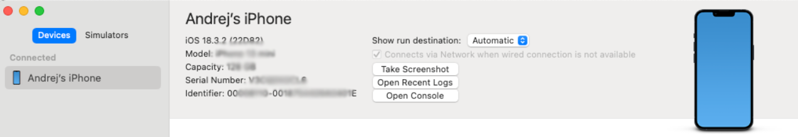
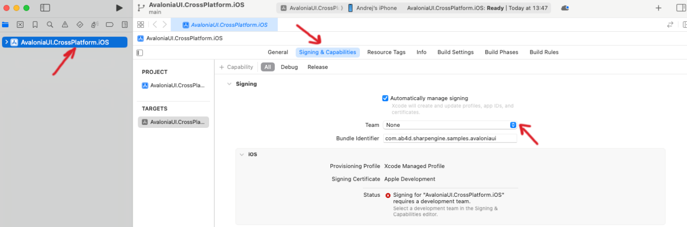
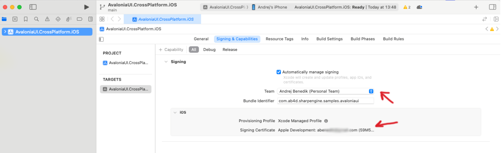

# Ab4d.SharpEngine.Samples


Welcome to the Samples for Ab4d.SharpEngine.

**Ab4d.SharpEngine is a cross-platform 3D rendering engine for desktop, mobile and browser .Net applications.**

<br>

The engine uses [Vulkan](https://www.vulkan.org/) for desktop and mobile apps (samples use [Ab4d.SharpEngine.Vulkan](https://www.nuget.org/packages/Ab4d.SharpEngine.Vulkan) NuGet package).
For the browser and browser based apps like Electron, the engine uses WebGL (samples use [Ab4d.SharpEngine.WebGL](https://www.nuget.org/packages/Ab4d.SharpEngine.WebGL) NuGet package).

> [!NOTE]  
> The [Ab4d.SharpEngine](https://www.nuget.org/packages/Ab4d.SharpEngine) NuGet package (without `.Vulkan` or `.WebGL`) was used
> for the previous versions of the engine (up to v3.2) and it used only Vulkan renderer. 
> Starting with v4.0, the Ab4d.SharpEngine.WebGL was introduced and to make the naming cleaner, the Ab4d.SharpEngine assembly was renamed to Ab4d.SharpEngine.Vulkan.

<br>

**Key featrues of the engine:**
- Using any coordinate system (y-up or z-up, right-handed or left-handed)
- Many SceneNode objects (boxes, spheres, planes, cones, lines, poly-lines, curves, etc.)
- Render line caps (arrows, etc.), line with pattern, poly-lines with miter or bevel connections, hidden lines <sup>*</sup>
- Object instancing (InstancedMeshNode)
- Render vector and bitmap text
- Advanced mesh generation: Boolean operations, extrusions, lathe, triangulation with holes.
- Cameras: TargetPositionCamera, FirstPersonCamera, FreeCamera, MatrixCamera
- Camera controllers that can rotate the camera around the mouse position, zoom to position and other advanced functions
- Lights: AmbientLight, DirectionalLight, PointLight, SpotLight, CameraLight
- Effects: StandardEffect, SolidColorEffect, VertexColorEffect, ThickLineEffect, PixelEffect, PhysicallyBasedRenderingEffect <sup>*</sup>
- Improved visual quality with super-sampling and multi-sampling <sup>*</sup>
- Render CT and MRI scans by using Volume rendering <sup>*</sup>
- Included reader and writer for .obj and .stl files
- Import 3D objects from glTF files and export the scene to glTF file by using [Ab4d.SharpEngine.glTF](https://www.nuget.org/packages/Ab4d.SharpEngine.glTF)
- Assimp importer that uses a [third-party library](https://github.com/assimp/assimp) to import 3D models from almost any file format <sup>*</sup>

 <sup>*</sup> Some features are not available for the browser (WebGL) version of the engine. See [Ab4d.SharpEngine.WebGL implementation details](#ab4d.sharpengine.webgl-implementation-details).


 <br>
Ab4d.SharpEngine library is a **commercial library** but it is also **free for non-commercial open-source projects**.

The commercial license can be purchased from [purchase web page](https://www.ab4d.com/Purchase.aspx). With a commercial license, you also get priority email support and other benefits (feature requests, online support on your projects with sharing screen, etc.).
To get a trial license for your own projects (not needed for the sample projects in this repo) or to apply for the free open-source license, see the [ab4d.com/trial](https://www.ab4d.com/trial).

## Platforms and UI frameworks

### Desktop and mobile platforms

Desktop and mobile platforms require [Ab4d.SharpEngine.Vulkan](https://www.nuget.org/packages/Ab4d.SharpEngine.Vulkan) NuGet package that uses Vulkan for rendering.
For the browser and browser based apps like Electron, the engine uses WebGL (samples use [Ab4d.SharpEngine.WebGL](https://www.nuget.org/packages/Ab4d.SharpEngine.WebGL) NuGet package).


**Windows:**
  - AvaloniaUI support with SharpEngineSceneView control (Ab4d.SharpEngine.AvaloniaUI library)
  - WPF full composition support with SharpEngineSceneView control (Ab4d.SharpEngine.Wpf library)
  - WinUI 3 support with SharpEngineSceneView control (Ab4d.SharpEngine.WinUI library)
  - WinForms support with SharpEngineSceneView control (Ab4d.SharpEngine.WinForms library)
  - Uno Platform
  - MAUI
  - Using SDL or Glfw (using a third-party Silk.Net library; the same project also works on Linux)
  - ImGui (using a third-party ImGui.NET library)
  
**Linux** (including Raspberry PI 4 and similar devices):
  - AvaloniaUI support with SharpEngineSceneView control (Ab4d.SharpEngine.AvaloniaUI library)
  - Uno Platform
  - Using SDL or Glfw (using third-party Silk.Net library; the same project also works on Windows)
  - Off-screen rendering combined with Linux framebuffer display (FbDev or DRM/KMS).
  - ImGui (using a third-party ImGui.NET library)
  - See ["Vulkan on Raspberry Pi 4"](https://www.ab4d.com/SharpEngine/Vulkan-rendering-engine-on-Raspberry-Pi-4.aspx) guide on how to use SharpEngine on Raspberry Pi 4 with an external monitor.
  
**Android:**
  - Using AvaloniaUI with SharpEngineSceneView control (Ab4d.SharpEngine.AvaloniaUI library).
  - Using SurfaceView in C# Android Application
  - MAUI
  
**macOS:**
  - Using AvaloniaUI with SharpEngineSceneView control (Ab4d.SharpEngine.AvaloniaUI library). It requires the MoltenVK library. See "Building for macOS and iOS" below.
  - Using MAUI - requires MoltenVK library - see "Building for macOS and iOS" below.
   
**iOS:**
  - AvaloniaUI with SharpEngineSceneView control (Ab4d.SharpEngine.AvaloniaUI library). It requires the MoltenVK library. See "Building for macOS and iOS" below.
  - Using MAUI - requires MoltenVK library - see "Building for macOS and iOS" below.

### Browser platform

Browser and browser based apps like Electron require [Ab4d.SharpEngine.WebGL](https://www.nuget.org/packages/Ab4d.SharpEngine.WebGL) NuGet package that uses WebGL rendering.

- **Blazor WebAssembly** provided best integration and is the only platform that supports full debugging.
  
- **HTML and JavaScript** are enough to run the project with Ab4d.SharpEngine.WebGL that was compiled into wasm.
To show the 3D scene in the browser, you can use any web server. The samples for the following web servers are provided:
  - ASP.NET Core
  - Node.js with Express
  - Python SocketServer

- **Electron** app can use the same wasm build as the browser


### Dependencies:
- The core Ab4d.SharpEngine.Vulkan library has NO EXTERNAL dependencies.
- The core Ab4d.SharpEngine.WebGL library has NO EXTERNAL dependencies.
- The Ab4d.SharpEngine.Wpf has NO EXTERNAL dependencies.
- The Ab4d.SharpEngine.WinUI has NO EXTERNAL dependencies.
- The Ab4d.SharpEngine.WinForms has NO EXTERNAL dependencies.
- The Ab4d.SharpEngine.AvaloniaUI library requires Avalonia library.
- The Ab4d.SharpEngine.glTF has NO EXTERNAL dependencies. But to load draco compressed meshes, the draco library is required (for example, Openize.Drako).


### System requirements to run the samples:
- NET 6.0+
- NET 8.0+ is required to use MAUI
- NET 9.0+ is required to use Ab4d.SharpEngine.WebGL (for the browser)


### System requirements to open the sample projects:
- Visual Studio 2026 on Windows to open all the projects because they use .Net 10 by default (by lowering the TargetFramework to .Net 8 or 9, you can also use Visual Studio 2022).
- Rider from JetBrains on Windows, Linux and macOS
- Visual Studio Code on Windows, Linux and macOS


## Sample solutions

### Desktop and mobile samples

The following .Net solutions (.sln files) are available for desktop and mobile platforms:

- **Ab4d.SharpEngine.Samples.AvaloniaUI**\
  This sample uses Avalonia UI (https://avaloniaui.net/) that provides WPF-like object model to 
  build UI controls and can run on Windows, Linux and macOS.
  This sample uses Ab4d.SharpEngine.AvaloniaUI library that provides SharpEngineSceneView control.
  The SharpEngineSceneView provides an Avalonia control that is very easy to use and can 
  compose the 3D scene with the Avalonia UI objects (for example, showing buttons on top of the 3D scene).
  The sample can be started on Windows, Linux, and macOS.
  See also "Building for macOS and iOS" section for more information on how to compile for macOS.

- **Ab4d.SharpEngine.Samples.AvaloniaUI.VulkanBackend**\
  This sample uses Avalonia UI, which uses Vulkan as a backend, so the whole application is using Vulkan API
  (the UI controls are also rendered by Vulkan instead of DirectX or OpenGL as by default).
  Vulkan backend is setup in the Program.cs file.
  This provides the best integration of 2D UI and 3D graphics.
  This sample can run only on Windows.

- **Ab4d.SharpEngine.Samples.AvaloniaUI.CrossPlatform**\
  This sample shows how to create an Avalonia app that can run on Windows, Linux, macOS, Android and iOS.
  This sample uses Ab4d.SharpEngine.AvaloniaUI library that provides SharpEngineSceneView control.
  Because Vulkan is not natively supported on macOS and iOS, the MoltenVK library is required to translate the Vulkan calls to Molten API calls.
  See also "Building for macOS and iOS" section for more information on how to compile for iOS.
  Note that folder and file names in this solution have been shortened to prevent problems with max path size on Windows (260 chars).

- **Ab4d.SharpEngine.Samples.Wpf**\
  This solution provides the samples for WPF and can run only on Windows.
  The samples also use Ab4d.SharpEngine.Wpf library that provides SharpEngineSceneView control for WPF.
  The SharpEngineSceneView provides a WPF control that is very easy to use and can 
  compose the 3D scene with the WPF objects (for example, showing buttons on top of the 3D scene).
  
- **Ab4d.SharpEngine.Samples.WinUI**\
  This sample uses WinUI 3.0, which provides the latest UI technology to create applications for Windows.
  This sample uses Ab4d.SharpEngine.WinUI library that provides SharpEngineSceneView control.
  The SharpEngineSceneView provides a WinUI control that is very easy to use and can 
  compose the 3D scene with the WinUI UI objects (for example, showing buttons on top of the 3D scene).
  
- **Ab4d.SharpEngine.Samples.UnoPlatform**\
  This sample uses Uno Platform, which provides a cross-plaform UI technology to create applications.
  Ab4d.SharpEngine samples for Uno Platform can run on Windows, macOS and Linux.
  Because this sample uses centralized .Net project configuration, the solution file (.sln) is located in 
  the Ab4d.SharpEngine.Samples.UnoPlatform folder.

- **Ab4d.SharpEngine.Samples.WinForms**\
  This solution provides the samples for WinForms and can run only on Windows.
  The samples also use Ab4d.SharpEngine.WinForms library that provides SharpEngineSceneView Control for WinForms.
  The SharpEngineSceneView provides a WinForms Control that is very easy to use and can 
  compose the 3D scene with other UI Controls (for example, showing buttons on top of the 3D scene).
  
- **Ab4d.SharpEngine.Samples.SilkNet.Sdl / .SilkNet.Glfw**\
  This sample uses a third-party Silk.Net library that provides support for SDL and GLFW.
  SDL and GLFW are used to get platform-independent ways to create windows and views.
  The 3D scene here is shown in the whole window area.
  This project can work on Windows and Linux.

- **Ab4d.SharpEngine.Samples.Android.Application**\
  This solution uses an Android.Application project template for .Net.
  The 3D scene is shown on the part of the view that is defined by SurfaceView.

- **Ab4d.SharpEngine.Samples.Maui**\
  This solution uses a NET Maui and can work on Windows, Android, macOS and iOS.
  Because Vulkan is not natively supported on macOS and iOS, the MoltenVK library is required to translate the Vulkan calls to Molten API calls.
  See "Building for macOS and iOS" section for more information on how to compile for macOS and iOS.

- **Ab4d.SharpEngine.Samples.LinuxFramebuffer**\
  This solution uses SharpEngine with an off-screen Vulkan renderer and displays
  the rendered frames on a Linux framebuffer display (FbDev or DRM/KMS). See
  [the example's README](Ab4d.SharpEngine.Samples.LinuxFramebuffer/README.md)
  for details.

- **Ab4d.SharpEngine.Samples.ImGui**
  This solution shows how to render a user interface that is defined by ImGui.
  It includes the ImGuiRenderingStep class with full source code that shows how to render ImGui by using Ab4d.SharpEngine.Vulkan.
  The solution is using a third-party ImGui.NET library (https://github.com/ImGuiNET/ImGui.NET).

### Browser based samples

The following .Net solutions (.sln files) are available for browser and browser based platforms:

- **Ab4d.SharpEngine.Samples.BlazorWasmFullyFeaturedDemo**\
  This solution shows how to use Ab4d.SharpEngine.WebGL in a **Blazor WebAssembly** app. It demonstrates most of the features of the engine. Using Blazor WebAssembly provides the best integration and debugging experience. 
  This solution uses `Ab4d.SharpEngine.Samples.Common.WebGL` that uses the same samples files as the desktop and mobile samples but with WebGL implementation. This allows to have the same code for desktop, mobile and browser platforms.
  See [readme](Ab4d.SharpEngine.Samples.BlazorWebAssembly/README.md).

- **Ab4d.SharpEngine.Samples.Electron**\
  This solution provides files and scripts to create an Electron app that can be used on Windows, macOS and Linux.
  It uses the compiled version of the fully featrues Blazor WebAssembly sample.
  See [readme](Ab4d.SharpEngine.Samples.Electron/README.md).

- **Ab4d.SharpEngine.Samples.HtmlWebPage**\
  This solution provides files and batch scripts that can prepare and start Node.js (with Express) or Python (SocketServer) web server.
  The sample uses a simple `Ab4d.SharpEngine.Samples.WebAssemblyDemo` project that shows only a simple 3D scene and provides code for simple JavaScript interop (updating the 3D scene from JavaScript).
  See [readme](Ab4d.SharpEngine.Samples.HtmlWebPage/README.md).

- **Ab4d.SharpEngine.Samples.AspNetCore**\
  This solution is same a HtmlWebPage but it uses ASP.NET Core to copy the required files into wwwroot folder and start the web server. 
  See [readme](Ab4d.SharpEngine.Samples.AspNetCore/README.md).

- **Ab4d.SharpEngine.Samples.BlazorWebAssemblyTesterApp**\
  This solution uses the same `Ab4d.SharpEngine.Samples.WebAssemblyDemo` project as HtmlWebPage and AspNetCore projects.
  The purpose of this solution is to create a Blazor WebAssembly app that can be debugged (this is not possible when started in some other web server).
  See [readme](Ab4d.SharpEngine.Samples.BlazorWebAssemblyTesterApp/README.md).


### Browser deployment tips

The browser samples are currently configured to run in the root folder without any subfolder ("http://localhost:5164/").

To deplay them into a subfolder, for example https://www.ab4d.com/sharp-engine-browser-demo/, you need to change the base path. 
To do that open the `wwwroot/index.html` file and change the
`<base href="/" />` to `<base href="/sharp-engine-browser-demo/" />`.

Then you can create the published version and deploy to the target subfolder.

To run the app in the subfolder **while debugging**, open the `Properties/launchSettings.json` file
and add the following two lines to each profile:
```
"commandLineArgs": "--pathbase=/sharp-engine-browser-demo",
"launchUrl": "sharp-engine-browser-demo"
```

After that you can run the Blazor WebAssembly app and it will start in a sharp-engine-browser-demo subfolder.


## Quick Start

The three main objects in Ab4d.SharpEngine are:
- **Scene** object that defines the 3D scene with a hierarchy of 3D objects that are added to the `RootNode` object.
  It also defines the `Lights` collection.
- **SceneView** object is used to show the objects that are defined by the Scene object. SceneView also defines the `Camera` and provides the size of the view.
- **VulkanDevice** object (many times named as `GpuDevice` property or parameter) provides the connection with the graphics card by using the Vulkan API.

When using Avalonia, WPF, WinUI or WinForms, then VulkanDevice, Scene and SceneView are created by the **SharpEngineSceneView control**.

3D objects are defined in the SceneNodes namespace, for example: `BoxModelNode`, `SphereModelNode`, `LineNode`, `MeshModelNode`, etc.

Common materials are defined by using `StandardMaterial` object. 
For each color there are predefined `StandardMaterials`, for example, `StandardMaterials.Blue`.

Use `ObjImported` or `StlImporter` to read 3D models from obj or stl files.
To read 3D models from glTF files use `gltfImporter` from the Ab4d.SharpEngine.glTF library. For other file formats, use `AssimpImporter` from Ab4d.SharpEngine.Assimp library.

### Step-by-step guide to use Ab4d.SharpEngine in your project
1. Generate the **Trial license** from [Trail license generator](https://www.ab4d.com/SharpEngineLicense.aspx). This is required to use the Ab4d.SharpEngine in your own project.
2. Create a **new project** in Visual Studio, any other IDE or CLI. Copy the **SharpEngine initialization code** from the sample project. When using Avalonia, WPF or WinUI, use the initialization code from QuickStart/SharpEngineSceneViewInXaml or QuickStart/SharpEngineSceneViewInCode files (depends on whether you want to define the `SharpEngineSceneView` control in XAML or in the code). For other UI frameworks copy the initialization code from the appropriate sample. In some cases, you will first need to initialize the `VulkanDevice` and then use that to initialize the `Scene` and `SceneView` objects (when using `SharpEngineSceneView` control, then `VulkanDevice` is created automatically).
3. Add the call to the **`SetLicense`** method by using your trial license code. Note that the `SetLicense` method must be called before the SharpEngine is initialized (for example, before calling `InitializeComponent`).
4. Define the **3D scene** by adding scene node objects to the `scene.RootNode`. Add code to support **user interaction** with the 3D scene. To do this quickly, run the Samples project and identify the parts you need for your applications. Then copy the code from the Ab4d.SharpEngine.Samples.Common project to your project (to get which source file is showing a particular sample, check the Samples.xml file).


### Migration guide for Ab3d.PowerToys and Ab3d.DXEngine users

Ab4d.SharpEngine is built on the same concepts as the Ab3d.PowerToys and Ab3d.DXEngine libraries. So users of those two libraries should feel very familiar. But there are some main differences:

For WPF, Avalonia, WinUI and WinForms there is a special library ([Ab4d.SharpEngine.Wpf](https://www.nuget.org/packages/Ab4d.SharpEngine.Wpf), [Ab4d.SharpEngine.AvaloniaUI](https://www.nuget.org/packages/Ab4d.SharpEngine.AvaloniaUI), [Ab4d.SharpEngine.WinUI](https://www.nuget.org/packages/Ab4d.SharpEngine.WinUI), [Ab4d.SharpEngine.WinForms](https://www.nuget.org/packages/Ab4d.SharpEngine.WinForms)) that defines the `SharpEngineSceneView` class. This class hides the differences between those platforms under the hood and provides the same API for all platforms. The class also initializes the engine by creating the `VulkanDevice`. The two main properties that `SharpEngineSceneView` provides are `Scene` and `SceneView`. The `Scene` is used to define the scene by adding the SceneNodes to the `Scene.RootNode` (similar as Viewport3D.Children in WPF) and adding lights to `Scene.Lights` collection. The `SceneView` defines the view of the scene and provides a camera that is set to the `SceneView.Camera` property. When working with `SharpEngineSceneView`, then **100% of the code** to show 3D graphics **can be the same for WPF, Avalonia, WinUI and WinForms**. Other platforms and UI frameworks require some special setup code that is different for each platform. But from there on, the code is the same regardless of the platform. See samples for more info.

Some other differences:

`BoxVisual3D`, `SphereVisual3D` and other objects derived from `BaseVisual3D` are defined in `Ab4d.SharpEngine.SceneNodes` namespace
(for example `BoxVisual3D` => `BoxModelNode`; `SphereVisual3D` => `SphereModelNode`).

`GeometryModel3D` with custom `MeshGeometry3D` from WPF 3D is now defined by `MeshModelNode` and `StandardMesh` (see [MeshModelNodeSample](https://github.com/ab4d/Ab4d.SharpEngine.Samples/blob/main/Ab4d.SharpEngine.Samples.Common/StandardModels/MeshModelNodeSample.cs).
Meshes for standard objects (box, sphere, cone, etc) can be created by using `Meshes.MeshFactory`.

Cameras and lights are almost the same as in Ab3d.PowerToys. The cameras are `TargetPositionCamera`, `FirstPersonCamera`, `FreeCamera` and `MatrixCamera` with the same properties as in Ab3d.PowerToys. Also lights (`DirectionalLight`, `PointLight`, `Spotlight`, `AmbientLight` are the same as in Ab3d.PowerToys.

`MouseCameraController` for WPF, Avalonia or WinUI is almost the same as in Ab3d.PowerToys.
For Android you can use `AndroidCameraController`.
For other platforms you can use `ManualMouseCameraController` and then call the `ProcessMouseDown`, `ProcessMouseUp` and `ProcessMouseMove methods` - see samples.

Just as Ab3d.PowerToys, the Ab3d.SharpEngine also defines the `ReaderObj` for reading 3D models from obj files. Also, to import models from other files, use the `Ab4d.SharpEngine.Assimp` library (similar to `Ab3d.PowerToys.Assimp` and `Ab3d.DXEngine.Assimp`).

To provide cross-platform reading of texture files (2D bitmap) the Ab4d.SharpEngine uses the `IBitmapIO` interface that provides the common bitmap IO operations. Then, there are platform specific implementations, for example `WpfBitmapIO`, `WinUIBitmapIO`, `SystemDrawingBitmapIO`, `SkiaSharpBitmapIO`. There is also a build-in `PngBitmapIO` that can read or write png images and does not require any third-party or platform-specific implementation.

Ab4d.SharpEngine uses `float` as its main value type and `System.Numerics` for base math objects and functions. This means that you need to convert all `double` values to `float` values. Also, `Point3D` and `Vector3D` structs need to be converted to `Vector3`.

In my opinion, if you already have a complex application that is built by using Ab3d.PowerToys and Ab3d.DXEngine and you are not required to use any other platform except Windows, then it is not worth converting that application to Ab4d.SharpEngine. But if you need to create a simpler version of the application that would also work on mobile devices, then Ab4d.SharpEngine gives you a great opportunity to port only a part of the code. Also, if you are starting to create an application that requires 3D graphics, then it is probably better to start with Ab4d.SharpEngine.

### Advantages of Ab3d.DXEngine with Ab3d.PowerToys

- Ab3d.DXEngine and Ab3d.PowerToys are very mature products that are tested and proven in the "field" by many customers.
- Ab3d.DXEngine supports multi-threading and currently provides faster 3D rendering in many use cases.
- Ab3d.DXEngine and Ab3d.PowerToys can run on older .Net versions including .Net framework 4.8.

Those two libraries provide more features and come with more samples that can be used as code templates for your needs.
The following is a list of major features from Ab3d.DXEngine and Ab3d.PowerToys that are missing in Ab4d.SharpEngine (v3.2; this is not the full list):
- Effects: XRay and face color effect
- Shadows


### Advantages of Ab4d.SharpEngine

- Ab4d.SharpEngine can run on multiple platforms. You can start writing code for Windows and later simply add support for Linux, macOS, Android and iOS. Or port just a smaller part of the application to other platforms.
- Ab4d.SharpEngine uses Vulkan API that is the most advanced graphics API that is actively developed and gets new features as new versions of graphics cards are released. This provides options to support all current and future graphics features (for example Ray tracing - not possible with DirectX 11).
- Ab4d.SharpEngine was built from the ground up and therefore has a very clean and easy-to-use programming API. For example, there is only a single set of 3D models (SceneNodes, Camera, Lights). When using Ab3d.DXEngine and Ab3d.PowerToys, the API is not very nice in all the cases. The Ab3d.PowerToy was built on top of WPF 3D objects that are not very extendable so some compromises were needed (for example, cameras are derived from FrameworkElement and not from Camera). Also, Ab3d.DXEngine converts all WPF 3D and Ab3d.PowerToys objects into its own objects so the application has 2 versions of each object. In other cases, some tricks must be used to provide Ab3d.DXEngine features to Ab3d.PowerToys and WPF 3D objects (for example using SetDXAttribute).
- Working with WPF objects is very slow (accessing DependencyProperties has a lot of overhead). Also, Ab3d.DXEngine needs to convert all WPF objects into its own objects. Working with objects in Ab4d.SharpEngine is much faster.
- Vulkan is a significantly faster graphics API than DirectX 11. Though the Ab4d.SharpEngine does not use all the fastest algorithms yet (no multi-threading), in the future the engine will be significantly faster than Ab3d.DXEngine.
- Ab4d.SharpEngine is built on top of .NET 6 and that provides many performance benefits because of using System.Numerics, Span and other improved .NET features.
- In the future Ab4d.SharpEngine will provide more functionality than Ab3d.DXEngine with Ab3d.PowerToys.

NOTE:
Ab3d.PowerToys and Ab3d.DXEngine will still be actively developed, will get new releases and features and will have full support in the future!


### How to share the code with for desktop, mobile and browser platforms

This section describes how to **share source code** that can be used **for the browser** (requires Ab4d.SharpEngine.WebGL) and **for the desktop and mobile devices** (requires Ab4d.SharpEngine.Vulkan).

Because both Ab4d.SharpEngine.Vulkan and Ab4d.SharpEngine.WebGL define the same namespaces and class names, it is not possible to add references to both libraries. 

Maybe in the future (not in the near future) there will be a common library (Ab4d.SharpEngine.Core or something similar) and a NuGet package that will load different assemblies based on the current platform. 

However, to use shared code now, I recommend using **two projects with linked files**.

In this case, you create two class library projects. One that references Ab4d.SharpEngine.Vulkan and the other that references Ab4d.SharpEngine.WebGL. You define the classes and files in the first project and use linked files in the second (to add the same files as defined in the first project). You can add linked files by using an IDE or by editing the csproj file. The latter is useful when you want to add multiple files. 

For example, the following code from csproj file add links to all cs files in `..\SharedGraphicsLib\Shared` folder and a single `..\SharedGraphicsLib\Custom\CusomFile.cs` file.
```
<ItemGroup>
    <Compile Include="..\SharedGraphicsLib\Shared\*.cs" LinkBase="Shared\"  />
    <Compile Include="..\SharedGraphicsLib\Custom\CusomFile.cs" Link="CusomFile.cs" />
</ItemGroup>
```

I also recommend that in the project with Ab4d.SharpEngine.Vulkan you define the `VULKAN` compiler constant. In the other project (with Ab4d.SharpEngine.WebGL) you define the `WEB_GL` compiler constant.
This can be defined by the adding `VULKAN` or `WEB_GL` to `DefineConstants` element in csproj file. For example, add the following to the root `PropertyGroup`:
```
<DefineConstants>VULKAN</DefineConstants>
```

Be careful that this value is not overwritten later in the csproj file. For example, this may occur when special DefineConstants are used for Debug and Release builds. To solve that, add the following in the later DefineConstants declaration:
```
<DefineConstants>$(DefineConstants);TRACE;DEBUG;</DefineConstants>
```

After you have the `VULKAN` and `WEB_GL` compiler constants defined, you can exclude some parts of the shared code by using `#if`, `#else`, `#elif` and `#endif`. For example, the following code defines the `CreateSomeLowLevelObject` method with a different method body:
```
public void CreateSomeLowLevelObject()
{
#if VULKAN
    // Vulkan specific code
#elif WEB_GL
    // Browser specific code
#endif
}
```

Larger classes can be divided into multiple partial classes: one shared, one for Vulkan and one for the browser. For example, you can have:
- ComplexGeometry3D.shared.cs
- ComplexGeometry3D.vulkan.cs // This file starts with "#if VULKAN"
- ComplexGeometry3D.webgl.cs  // This file starts with "#if WEB_GL"


If you need to use **VulkanDevice** and **WebGLDevice** in the same file, you can define a common alias for both classes. For example, in the file header you can use:

```
#if VULKAN
using Ab4d.Vulkan;
using Ab4d.SharpEngine.Vulkan;
using GpuDevice = Ab4d.SharpEngine.Vulkan.VulkanDevice;
#endif
#if WEB_GL
using Ab4d.SharpEngine.WebGL;
using GpuDevice = Ab4d.SharpEngine.WebGL.WebGLDevice;
#endif
```

Then you can use the `GpuDevice` type. When compiling, that will be replaced by the `VulkanDevice` or `WebGLDevice`. For example,
```
private void RecreateIndexBuffer(GpuDevice gpuDevice)
```


## Quick building instructions for macOS and iOS

The following projects can be started on **macOS**:
- Ab4d.SharpEngine.Samples.AvaloniaUI
- Ab4d.SharpEngine.Samples.AvaloniaUI.CrossPlatform/Desktop
- Ab4d.SharpEngine.Samples.Maui

The following projects can be started on **iOS**:
- Ab4d.SharpEngine.Samples.AvaloniaUI.CrossPlatform/iOS
- Ab4d.SharpEngine.Samples.Maui
 
The following changes are required to use Ab4d.SharpEngine on macOS and iOS:

- Add libMoltenVK.dylib from the Vulkan SDK to the project so that the library can be loaded at runtime. Note that there are different builds for iOS and for macOS / MacCatalyst. The libMoltenVK.dylib is also available in the libs folder in this repository. For example, in the Ab4d.SharpEngine.Samples.AvaloniaUI.CrossPlatform solution the csproj file for the Desktop project has the following:
  ```
  <!-- MacOS and iOS require libMoltenVK.dylib to be able to use SharpEngine with Vulkan -->
  <ItemGroup Condition="$([MSBuild]::IsOSPlatform('macos'))">
    <Content Include="../../lib/MoltenVK/macos-arm64_x86_64/libMoltenVK.dylib" PublishFolderType="Assembly">
      <Link>libMoltenVK.dylib</Link>
      <CopyToOutputDirectory>PreserveNewest</CopyToOutputDirectory>
    </Content>
  </ItemGroup>    
  ```
  The following is used for iOS project:
  ```
  <!-- iOS requires libMoltenVK.dylib to be able to use SharpEngine with Vulkan -->
  <!-- When starting iOS simulator, use the dylib from ios-arm64_x86_64-simulator folder -->
  <ItemGroup>
    <Content Include="../../lib/MoltenVK/ios-arm64/libMoltenVK.dylib">
      <Link>libMoltenVK.dylib</Link>
      <CopyToOutputDirectory>PreserveNewest</CopyToOutputDirectory>
    </Content>
  </ItemGroup>  
  ```
  Another option for macOS (not for iOS) is to install the Vulkan SDK to the computer (https://vulkan.lunarg.com/sdk/home#mac). In this case the Ab4d.SharpEngine should be able to find the libMoltenVK.dylib from the default location and you do not need to add it to the csproj. But in this case you will not be able to distribute the app to another computer that does not have Vulkan SDK installed.

- For MAUI apps, the 3D scene that is rendered by Ab4d.SharpEngine is shown by using SKCanvasView. To use that control, add a reference to SkiaSharp.Views.Maui.Controls NuGet package. Then add ".UseSkiaSharp()" to the builder setup in the MauiProgram.cs file.
  
- To run the app on iOS (not required for the iOS simulator), the application needs to have a provisioning profile set. One option is to follow the instructions on the following page: [Create a provisioning profile](https://learn.microsoft.com/en-us/dotnet/maui/ios/capabilities?view=net-maui-8.0&tabs=vs#create-a-provisioning-profile). Another option is to open the project in the Rider IDE, then right-click on the project and select "Open in Xcode". Rider will create the Xcode project file and open it in Xcode. There you can click on the project file and in the "Certificates, Identifiers & Profiles" tab create an ad-hoc provisioning profile (allow having up to 3 development apps installed at the same time). See more: [Create a development provisioning profile](https://developer.apple.com/help/account/manage-profiles/create-a-development-provisioning-profile/). Note that to create the provisioning profile, the ApplicationId (in csproj file) needs to be in the form of "com.companyName.appName" - this is then used as a Bundle Id.

- In iOS project make sure that the `ApplicationId` property is defined in the csproj file. Typically, a reverse-DNS format is used for this value, for example: com.company_name.app_name. Also, its value must be the same as the `CFBundleIdentifier` property in the Info.plist (in MAUI project this file is located in the Platforms/iOS folder). Also, the value for `SupportedOSPlatformVersion` in csproj must match the value of `MinimumOSVersion` in Info.plist.

- .Net 8 is required to use Ab4d.SharpEngine on iOS (because function pointers do not work with .Net 7 and previous .Net versions on iOS).

See detailed instructions below for more information.

## Step by step instructions to run the samples on macOS and iOS ##

**Starting on macOS**:
1. Download the latest version of dotnet - see https://dotnet.microsoft.com/en-us/download
2. Download SharpEngine samples from this repo and extract them to any folder.
3. Right click on a folder from the extracted files (for example, on Ab4d.SharpEngine.Samples.AvaloniaUI) and select "New Terminal at Folder"
4. Run the following in terminal (if there is only one project in the folder, then you can skip the ´--project´ parameter; replace the project name with some other project name if needed):
   ´dotnet run --project Ab4d.SharpEngine.Samples.AvaloniaUI.macos.csproj´
5. This will start the sample application with SharpEngine on macOS.

You can also easily start the project from **Visual Studio Code** or **Rider** from JetBrains.


**Starting on iOS**:
1. Install XCode
2. When XCode is started, install iOS platform support
3. Connect your iPhone by USB cable and then open the following menu in XCode: Window - Devices and Simulators - allow the connection on iPhone and check that you see something similar:

4. In terminal open the Ab4d.SharpEngine.Samples.AvaloniaUI.CrossPlatform/iOS folder
5. Run the following: `sudo dotnet workload install ios`
6. To compile and run the app, use the following command (replace the device name with the Identifier from the XCode devices - on the screen that is shown on the screenshot above right click on the Identifier text and select Copy):
   `dotnet build -t:Run -p:Configuration=Debug -r ios-arm64 /p:_DeviceName=xxxxxxxxxx-xxxxxxxxxxxxxxxxxxxx`
7. At that point you should get the following compiler error:
   `No valid iOS code signing keys found in keychain. You need to request a code signing certificate from https://developer.apple.com.`
8. To add the certificate, make sure that you are signed into XCode. Go to XCode - Settings - check the Accounts tab. If no account is listed, click + to add your account. To create a new Apple developer account, visit https://developer.apple.com (you can also create a free account).
9. If you are using Rider from JetBrains, then you can open the solution there. Then right click on the iOS project and select "Open with XCode". Then proceed to the step 17.
10. When using CLI or Visual Studio Code, you can create the provisioning profile with the certificate by using the xcsync (this tool came with .Net 9; see https://learn.microsoft.com/en-us/dotnet/maui/macios/xcsync?view=net-maui-9.0&tabs=cli). To install and use xcsync do the following:
11. Run the following (2025-05-15):
    ```
    dotnet tool install dotnet-xcsync -g --prerelease --add-source https://pkgs.dev.azure.com/dnceng/public/_packaging/dotnet9/nuget/v3/index.json
    ```
13. As instructed by the output, run the following:
	   ```
    cat << \EOF >> ~/.zprofile
	   # Add .NET Core SDK tools
	   export PATH="$PATH:/Users/abenedik/.dotnet/tools"
	   EOF
    ```
14. Then run: `zsh -l`
15. After that you should be able to run:
	   `xcsync generate  --target-framework-moniker net9.0-ios --open`
16. This generates the xcode project for the first time - for example the following output will be shown:
	   `Generated Xcode project at 'obj/Debug/net9.0-ios/iossimulator-arm64/xcsync'`
17. To update the xcode project later, run the following:
	   `xcsync sync`
18. The XCode will open with the specified project. On the left click on the project name. Then click on the "Signing & Capabilities":

19. In the Team dropdown select your provisioning team. After a few seconds the Signing Certificate should change to your certificate:

20. If you are using Rider, then you can start the iOS project (before that select the iOS device from the dropdown on the top line left to the project name).
21. If you are using CLI or Visual Studio Code, do the following:
22. Extract the CodesignKey by executing the following command in the terminal:
    `security find-identity -p codesigning -v`
23. This prints the following (actual values are replaced by x and X):
    `xxxxxxxxxxxxxxxxxxxxxx "Apple Development: axxxxxxk@xxxx.com (XXXXXXX)"`
24. Open AvaloniaUI.CrossPlatform.iOS.csproj and add the following (copy the text from the terminal):
    ```
    <PropertyGroup>
        <CodesignKey>Aple Development: axxxxxxk@xxxx.com (XXXXXXX)</CodesignKey>
        <CodesignProvision>Automatic</CodesignProvision>
    </PropertyGroup>
    ```
25. Now you should be able to run the app by using the following command (replace the device name with your Identity):
`dotnet build -t:Run -p:Configuration=Debug -r ios-arm64 /p:_DeviceName=xxxxxxxxxx-xxxxxxxxxxxxxxxxxxxx`
26. When the app is deployed to iPhone, you will get a warning that the developer is not trusted. To allow the developer on the phone go to Settings > General > VPN & Device Management. In the Enterprise App section, tap the name of the app developer. Tap "Trust [developer name]" to continue. In iOS 18, iPadOS 18, and visionOS 2 and later, tap "Allow & Restart" to proceed with establishing trust. Then start the app again.

To get **better error diagnostics when running dotnet build**, add the following parameters: `-v diag /p:WarningLevel=4 --tl:off`

### Ab4d.SharpEngine.WebGL implementation details

The Ab4d.SharpEngine.WebGL does not yet have all the features of the Ab4d.SharpEngine.Vulkan version.

Namespace implementation status:
- **Animation**: 100% implemented :heavy_check_mark:
- **Cameras**: 100% implemented :heavy_check_mark:
- **Materials**:
    - StandardEffect - 100% implemented :heavy_check_mark:
    - ThickLineEffect - LineThickness, line patterns and line caps and hidden lines are not supported.   
      WebGL does not support thick lines or geometry shader so this requires a different approach (probably CPU based mesh generation). This will be supported after v1.0. Use TubeLineModelNode and TubePathModelNode with SolidColorMaterial for thick lines (here the line thickness in not in screen space values).
    - PixelEffect - planned for next version :hourglass_flowing_sand:
    - SpriteEffect - planned for next version :hourglass_flowing_sand:
    - VertexColorEffect - planned for next version :hourglass_flowing_sand:
    - VolumeRenderingEffect - supported later :two:
- **Lights**: 100% implemented :heavy_check_mark:
- **Materials**: 
    - StandardMaterial - 100% implemented :heavy_check_mark:
    - SolidColorMaterial - (using StandardEffect) - 100% implemented :heavy_check_mark:
    - LineMaterial - Rendering colored lines with 1px line thickness. See comment with ThickLineEffect for more info.
    - PolyLineMaterial - Polylines are rendered as multiple individual lines. Because line thickness is limited to 1px, no mitered and beveled joints are required.
    - PositionColoredLineMaterial - supported later :two:
    - VertexColorMaterial - planned for next version :hourglass_flowing_sand:
    - PrimitiveIdMaterial - planned after v1.1 :hourglass_flowing_sand:
    - DepthOnlyMaterial - supported later :two:
    - VolumeMaterial - supported later :two:
- **Meshes**: all supported except SubMesh (planned for next version) :hourglass_flowing_sand:
- **OverlayPanels**: CameraAxisPanel planned for next version :hourglass_flowing_sand:
- **PostProcessing**: planned after v1.1 :hourglass_flowing_sand:
- **SceneNodes**: all supported except: MultiMaterialModelNode and PixelsNode. All planned for next version :hourglass_flowing_sand:
- **Transformations**: 100% implemented :heavy_check_mark:
- **Utilities**: implemented all except:
    - BezierCurve, BSpline - 100% implemented :heavy_check_mark:
    - BitmapTextCreator - 100% implemented :heavy_check_mark:
    - CameraController - 100% implemented :heavy_check_mark:
    - EdgeLinesFactory - 100% implemented :heavy_check_mark:
    - CameraUtils, LineUtils, MathUtils, MeshUtils, ModelUtils, TransformationUtils - 100% implemented :heavy_check_mark:
    - LineSelectorData (used for line selection) - 100% implemented :heavy_check_mark:
    - MeshBooleanOperations - 100% implemented :heavy_check_mark:
    - MeshOctree - 100% implemented :heavy_check_mark:
    - MeshTrianglesSorter - 100% implemented :heavy_check_mark:
    - ModelMover, ModelRotator and ModelScalar - planned for next version :hourglass_flowing_sand:
    - ObjImporter - 100% implemented :heavy_check_mark:
    - ObjExporter - planned for next version :hourglass_flowing_sand:
    - StlImporter - 100% implemented :heavy_check_mark:
    - StlExporter - planned for next version :hourglass_flowing_sand:
    - glTFImporter - 100% implemented :heavy_check_mark:
    - TextureLoader, TextureFactory - 100% implemented :heavy_check_mark:
    - Triangulator - 100% implemented :heavy_check_mark:
    - TrueTypeFontLoader, VectorFontFactory - 100% implemented :heavy_check_mark:
    - SpriteBatch - planned for next version :hourglass_flowing_sand:
   
Other not implemented features:
- Super-sampling (planned for later)


## Troubleshooting

- [Performance tips](./doc/performance.md)

- [Install DiagnosticsWindow in your app](#how-to-install-diagnosticswindow-to-your-app)

- In case of problems in the browser (using Ab4d.SharpEngine.WebGL) please check the Console in the browser's DevTools (F12). Usually, error messages are displayed there.

- To solve some unusual build errors, sometimes it helps to close the Visual Studio (or some other IDE), delete the obj folder, open Visual Studio again and then try to recompile the solution (this works better than selecting "Clean" option in Visual Studio).

- Use the latest version of the **'main' branch**. This version works with the latest published NuGet package. The latest source from the **'development' branch** may require the latest development version of the engine that is not publicly available. If you need a feature from that branch, you can contact support to get the pre-release version.

- When using `dotnet build` command and you get an error message that you do not understand, it is possible to get additional error details by adding the following parameters: `-v diag /p:WarningLevel=4 --tl:off`.

- If you get build errors on Windows (for example, 'project.assets.json' not found), then maybe the total path length is larger than the maximum path length (260 chars). Move the sample solution to a folder with a shorter path and try compiling again.

- If the 3D scene is not correctly rendered, the Ab4d.SharpEngine may write warning or error messages about the reasons for the problems. Those messages can be shown by enabling **logging**. To do that, use the following code:
  ```
  Ab4d.SharpEngine.Utilities.Log.LogLevel = LogLevels.Warn;
  ```

  Then you have multiple options to display or save log messages:
  ```
  // Write log messages to the output window (for example, Visual Studio Debug window) 
  // Ab4d.SharpEngine.Utilities.Log.IsLoggingToDebugOutput = true; 

  // Write log to a file
  Ab4d.SharpEngine.Utilities.Log.LogFileName = @"c:\SharpEngine.log";
   
  // Write to a local StringBuilder
  private System.Text.StringBuilder _logStringBuilder;
  Ab4d.SharpEngine.Utilities.Log.AddLogListener((logLevel, message) => _logStringBuilder.AppendLine(message));
  ```

  To get simplified log messages (without timestamp, thread ID and some other details) you can use:
  ```
  Ab4d.SharpEngine.Utilities.Log.WriteSimplifiedLogMessage = true;
  ```

  For the brower (using Ab4d.SharpEngine.WebGL), you can enable additional logging by setting `CanvasInterop.IsLoggingInteropEvents` and `isLogging` in `sharp-engine.js` to true.

- To enable **Vulkan validation**, install the Vulkan SDK from: https://vulkan.lunarg.com/
  When Vulkan validation is installed and enabled by the Ab4d.SharpEngine (`EngineCreateOptions.EnableStandardValidation` is set to true when creating the engine),
  then each Vulkan call is checked by the validation layer and this can give much better error reports (all Vulkan validation reports are logged at Warn log level).


## How to install DiagnosticsWindow to your app (desktop apps only)

**DiagnosticsWindow** provides advanced rendering diagnostics for Ab4d.SharpEngine (works only for the desktop). It is available for Avalonia, WPF and WinUI apps. The DiagnosticsWindow displays exact times for each part of the rendering pipeline, providing valuable insight into the engine's performance. It also provides menu items to quickly get details about the scene hierarchy, rendering items, rendering steps, memory usage and other behind-the-scenes data. It is recommended that for the DEBUG build, you add the DiagnosticsWindow to your application.

  The following are the steps to add the DiagnosticsWindow to your project:
  - Create a new Diagnostics folder in your project.
  - Copy the `DiagnosticsWindow.xaml`, `DiagnosticsWindow.xaml.cs`, `LogMessagesWindow.xaml` and `LogMessagesWindow.xaml.cs` files from the Diagnostics folder in the Avalonia, WPF or WinUI samples project to the Diagnostics folder in your project.
  - Copy the `CommonDiagnostics.cs` file from the `Ab4d.SharpEngine.Samples.Common` project to the Diagnostics folder in your project.
  - Open csproj file of your project and add the following to remove Diagnostics files from the Release build (leave this step if you want to preserve the diagnostics window in the Release build):
    ```
    <ItemGroup Condition="'$(Configuration)'=='Release'">
      <Compile Remove="Diagnostics\*.cs" />
      <Page Remove="Diagnostics\*.xaml" />  <!--use AvaloniaXaml instead of Page for Avalonia UI app-->
    </ItemGroup>
    ```
  - In your application use "#if DEBUG" to add a button or some other way for the user of your application to open the Diagnostics window. In the button event handler, create an instance of the `DiagnosticsWindow` and set the `SharpEngineSceneView` property to your instance of the SharpEngineSceneView object. Then show the DiagnosticsWindow. See the `OpenDiagnosticsWindow` method for an example code.


## Change log
See https://www.ab4d.com/SharpEngine-history.aspx.


## Plans for later versions

- Shadows
- Multi-threaded rendering
- Simplified creation of custom effects
- Improve documentation and provide SKILL.md and related skill files for the AI agents to be able to use the engine.


### Notice:
Ab4d.SharpEngine.glTF library uses source code from glTF2Loader with PR from ZingBallyhoo (https://github.com/KhronosGroup/glTF-CSharp-Loader/pull/51).
glTF2Loader library is published under the following MIT license:

This license is for the C# reference loader, not the rest of the repository.

Copyright (c) 2015, Matthew and Xueru McMullan All rights reserved.

Redistribution and use in source and binary forms, with or without modification, are permitted provided that the following conditions are met:

Redistributions of source code must retain the above copyright notice, this list of conditions and the following disclaimer.

Redistributions in binary form must reproduce the above copyright notice, this list of conditions and the following disclaimer in the documentation and/or other materials provided with the distribution.

THIS SOFTWARE IS PROVIDED BY THE COPYRIGHT HOLDERS AND CONTRIBUTORS "AS IS" AND ANY EXPRESS OR IMPLIED WARRANTIES, INCLUDING, BUT NOT LIMITED TO, THE IMPLIED WARRANTIES OF MERCHANTABILITY AND FITNESS FOR A PARTICULAR PURPOSE ARE DISCLAIMED. IN NO EVENT SHALL THE COPYRIGHT HOLDER OR CONTRIBUTORS BE LIABLE FOR ANY DIRECT, INDIRECT, INCIDENTAL, SPECIAL, EXEMPLARY, OR CONSEQUENTIAL DAMAGES (INCLUDING, BUT NOT LIMITED TO, PROCUREMENT OF SUBSTITUTE GOODS OR SERVICES; LOSS OF USE, DATA, OR PROFITS; OR BUSINESS INTERRUPTION) HOWEVER CAUSED AND ON ANY THEORY OF LIABILITY, WHETHER IN CONTRACT, STRICT LIABILITY, OR TORT (INCLUDING NEGLIGENCE OR OTHERWISE) ARISING IN ANY WAY OUT OF THE USE OF THIS SOFTWARE, EVEN IF ADVISED OF THE POSSIBILITY OF SUCH DAMAGE.
